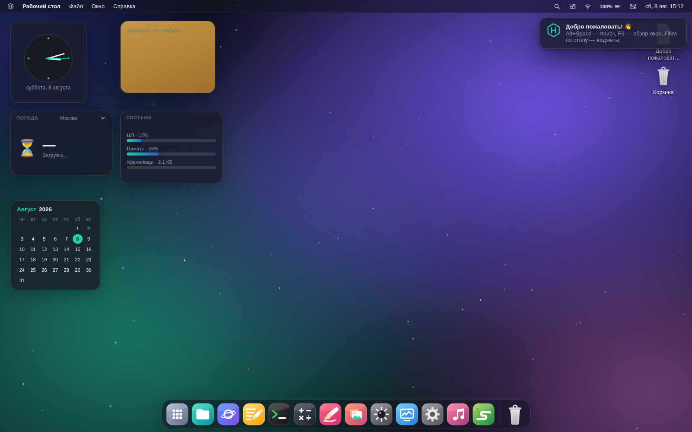
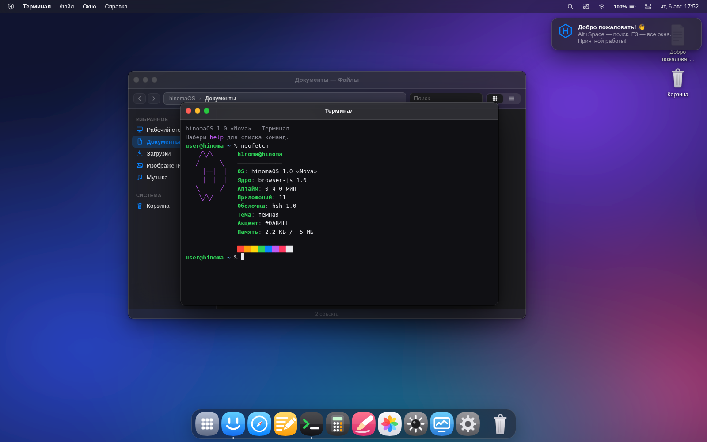
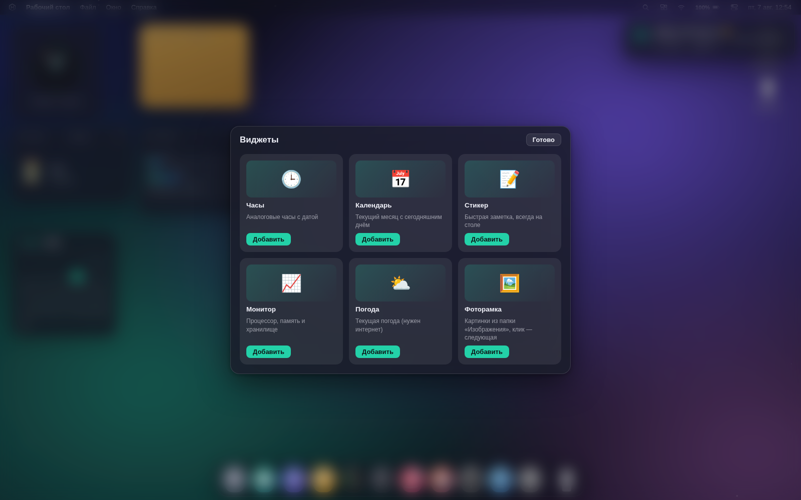
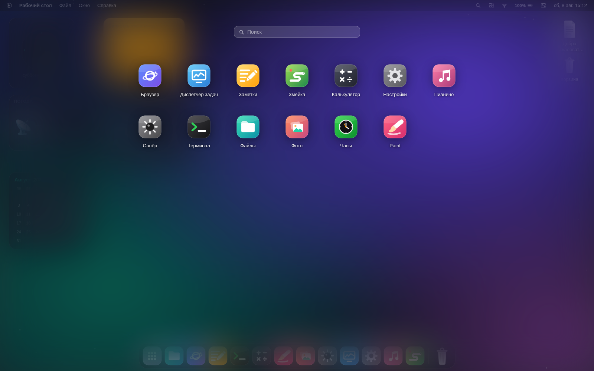
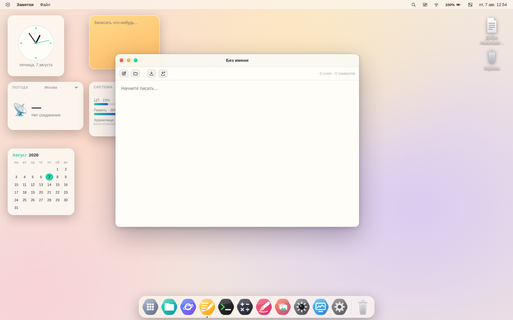
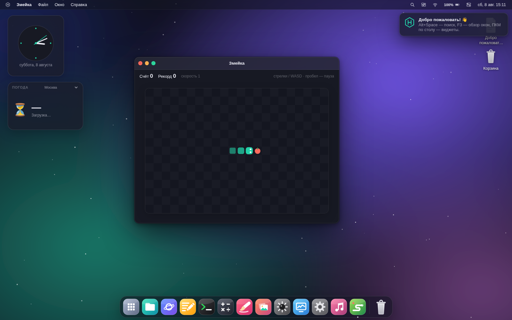
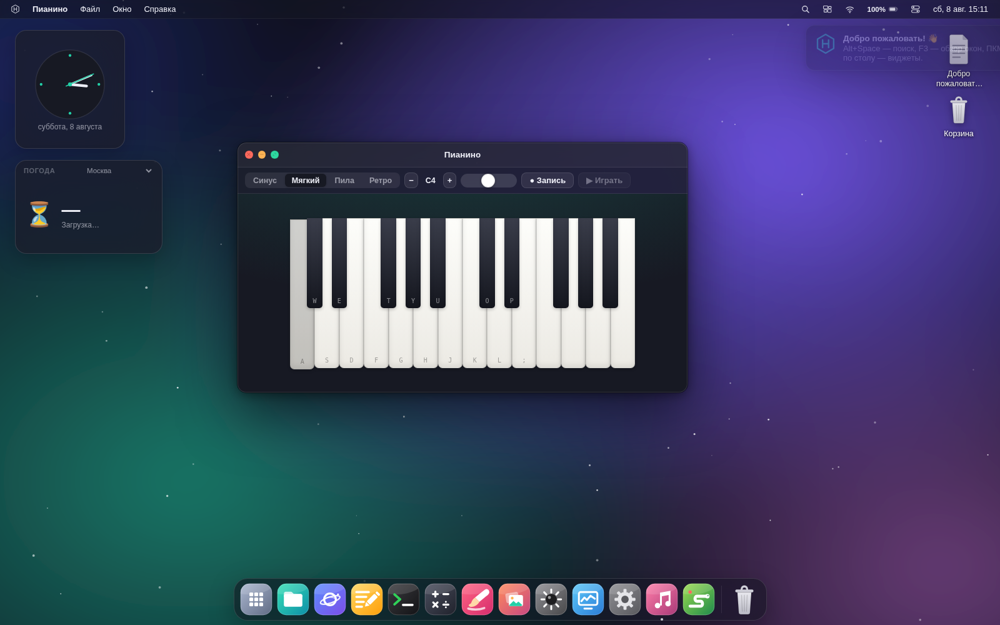
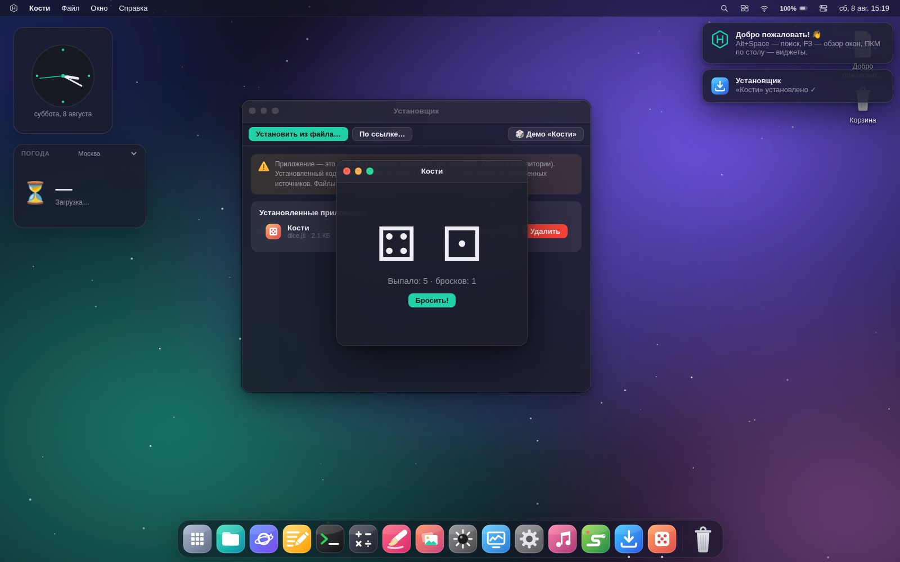
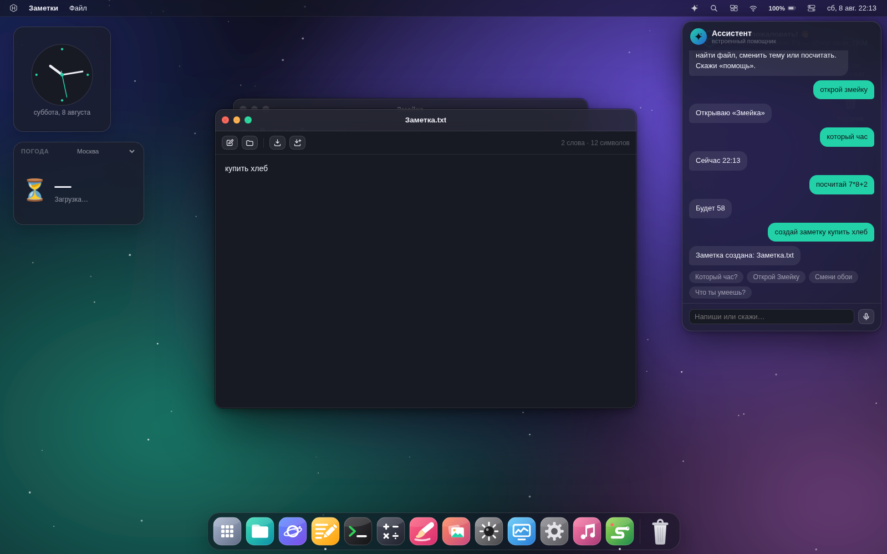

# Hiko OS

**Персональная операционная система в браузере — со своим характером.**
Свой визуал, привычная логика настольных систем, виджеты, ассистент.
Чистый JavaScript: ноль зависимостей.



## Установка и запуск

**Релиз (рекомендуется):** тег `v1.0.0` → `dist/Hiko-1.0.0-windows.zip`.
Распакуй хоть в `D:\Hiko`, запусти `Hiko.bat` — Hiko откроется отдельным
окном без браузерных панелей; `F11` — полный экран, `Alt+Tab` — обратно в Windows.
Подробно (автозапуск, перенос на другой диск, киоск-режим): [docs/INSTALL.ru.md](docs/INSTALL.ru.md).

**Из исходников:** открой `index.html` в браузере или `npx serve .`.
**Сборка релиза:** `python3 tools/build.py` → `dist/Hiko.html` (вся система одним файлом) + zip.

Все данные (файлы, настройки, виджеты) хранятся локально в `localStorage` твоего браузера.

## Фирменный стиль

- **Мягкие плитки** приложений с диагональными градиентами; гексагон — только в логотипе
- **Палитра «Нова»** — мята + ирис по умолчанию; 8 акцентов («Мята», «Ирис», «Коралл», «Янтарь», «Лазурь», «Роза», «Лайм», «Сталь») — акцент прокрашивает всю систему, парный тон градиентов вычисляется автоматически
- **Тёмная тема** — глубокий «космос» с фиолетовым подтоном; **светлая** — тёплая слоновая кость
- **8 обоев** с туманностями и звёздами: Небула, Мятный бриз, Дюна, Аврора, Глубина, Уголь, Рассвет, Сад

| | |
|---|---|
|  |  |
|  |  |
|  |  |

## Виджеты рабочего стола

ПКМ по рабочему столу → **«Добавить виджет…»**. Виджеты перетаскиваются, позиции и данные сохраняются.

| Виджет | Что умеет |
|---|---|
| **Часы** | Аналоговый циферблат с секундной стрелкой и датой |
| **Календарь** | Текущий месяц, сегодняшний день подсвечен |
| **Стикер** | Быстрая заметка прямо на столе |
| **Монитор** | ЦП, память и реальная занятость хранилища |
| **Погода** | Живая погода по 7 городам (open-meteo, офлайн-кэш) |
| **Фоторамка** | Картинки из «Изображений», клик — следующая |

Свой виджет — это `OS.widgets.register({id, name, w, h, render})` в одном файле.

## Установка приложений

Приложение **Установщик** ставит новые приложения прямо в работающую систему:

- **Из файла** — любой `.js` в формате Hiko OS ([docs/APP_API.md](docs/APP_API.md))
- **По ссылке из интернета** — прямой URL на `.js` (подходят raw.githubusercontent.com, gist, jsdelivr, unpkg)
- **Демо «Кости»** — встроенный пример в один клик
- В терминале: `install <url>` или `install /Documents/моё.js`

Установленное хранится в папке `/Apps`, загружается при каждом старте и удаляется
там же в Установщике. Перед установкой система честно предупреждает: чужой код
получает полный доступ к Hiko OS — ставь только то, чему доверяешь.



## Ассистент

Кнопка ✦ в строке меню, `Ctrl+Alt+H` или горячий угол. Встроенный помощник понимает:
«открой змейку», «создай заметку …», «найди …», «смени обои», «тёмная тема»,
«который час», «посчитай 22*3», «громкость 50», «заблокируй» — и умеет говорить
(системный синтез речи) и слушать (микрофон).

Главное: это **шина для твоего собственного голосового ассистента** —
внешний провайдер подключается одним вызовом `OS.assistant.registerProvider({...})`
и получает командную шину всей системы. Контракт: [docs/ASSISTANT_API.md](docs/ASSISTANT_API.md).



### Система
- **Оконный менеджер** — перетаскивание, ресайз за 8 граней, прикрепление к краям с превью, раскладки на зелёной кнопке, Aero Shake
- **Alt + Tab** — переключатель окон, **F3** — обзор всех окон
- **Панель приложений** с магнификацией и индикаторами запущенных
- **Поиск** (Alt + Space) — приложения, файлы, действия
- **Экран приложений**, быстрые настройки, уведомления с центром и календарём
- **Файловая система** с корзиной и восстановлением
- **Горячие углы** — действие при касании угла экрана (настраиваются)
- **Показать стол** — свернуть всё и вернуть одним действием
- **Живой калькулятор в Поиске** — набери «22*3+5» и получи ответ
- Экран блокировки с **паролем** (по желанию), загрузка, выключение; «Тёплый свет», яркость
- **Защита данных**: экспорт/импорт всей системы в JSON-файл, автокопия файловой
  системы с восстановлением, лимиты хранилища с понятными ошибками
- Плавные анимации везде — и уважение к prefers-reduced-motion

### Приложения
| | |
|---|---|
| **Файлы** | Проводник: хлебные крошки, два вида, буфер обмена, корзина |
| **Терминал** | ls, cd, cat, echo >, neofetch и ещё дюжина команд над реальной ФС |
| **Заметки** | Текстовый редактор с предпросмотром Markdown |
| **Калькулятор** | Полноценный, с клавиатурой и памятью операций |
| **Браузер** | Мини-браузер со стартовой страницей и закладками |
| **Фото** | Галерея, просмотр, зум; установка обоев |
| **Paint** | Кисти, фигуры, заливка, пипетка, Undo/Redo, сохранение в PNG |
| **Сапёр** | Классика: 3 уровня, флаги, chord-клики, рекорды |
| **Змейка** | Ускоряется с очками, пауза, рекорды |
| **Пианино** | Синтезатор: 4 тембра, 2 октавы, игра с клавиатуры, запись мелодий |
| **Диспетчер задач** | Процессы, «Снять задачу», живые графики ЦП/памяти |
| **Часы** | Мировое время, секундомер с кругами, таймер |
| **Настройки** | Темы, акценты, обои, панель, пользователь, сброс |
| **Установщик** | Установка приложений из файла и из интернета |

## Горячие клавиши

| Сочетание | Действие |
|---|---|
| `Alt + Space` | Поиск |
| `Alt + Tab` | Переключение окон |
| `F3` | Обзор окон |
| `Ctrl + Alt + ← / →` | Прикрепить окно влево/вправо |
| `Ctrl + Alt + ↑ / ↓` | Развернуть / свернуть окно |
| `Ctrl + W` | Закрыть окно |
| `Ctrl + Alt + H` | Ассистент |
| `Ctrl + Alt + L` | Заблокировать экран |
| `F2` | Переименовать файл |

## Архитектура

```
index.html
css/system.css        — дизайн-система (палитра, темы, UI-кит)
js/core/
  kernel.js           — шина событий, настройки, реестр приложений, диалоги
  vfs.js              — файловая система (localStorage)
  wallpapers.js       — генератор обоев (туманности + звёзды)
  wm.js               — оконный менеджер (снэп, Alt+Tab, обзор окон)
  widgets.js          — виджеты рабочего стола
  assistant.js        — шина ассистента (+ подключение голосового)
  menubar.js  dock.js  desktop.js  overlays.js  boot.js
js/apps/              — приложения (по одному файлу, см. docs/APP_API.md)
```

Хочешь своё приложение? Читай [docs/APP_API.md](docs/APP_API.md) — файл на 30 строк уже даёт окно, иконку на панели и место среди приложений.

---

Сделано с 🤍 Клодиком для братика.
